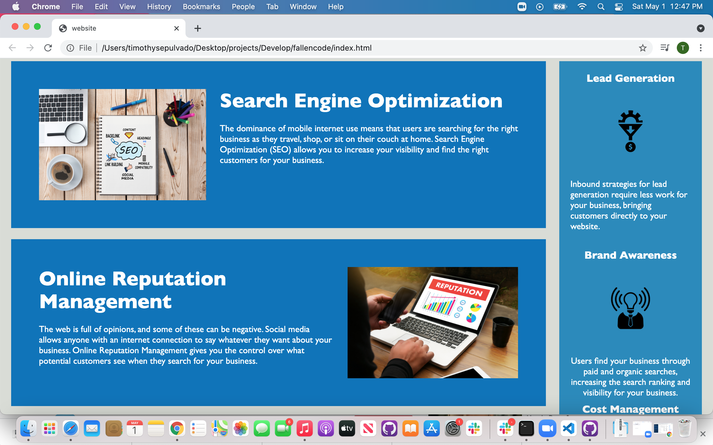

# Horiseon Home Page

## Technologies Used
 * HTML
 * CSS

## search engine optimization

## online reputation managment

## social medea marketing

## **Seach engine optimization "Box"**
 The dominance of mobile internet use means that users are searching for the right business as they travel, shop, or sit on their couch at home. Search Engine Optimization (SEO) allows you to increase your visibility and find the right customers for your business.

## Online Reputation Management "Box"
 The web is full of opinions, and some of these can be negative. Social media allows anyone with an internet connection to say whatever they want about your business. Online Reputation Management gives you the control over what potential customers see when they search for your business.

## Social Media Marketing "Box"
 Social media continues to have a sizable influence on buying habits. Social media marketing helps you determine which platforms are suited to your brand, using analytics to find the right markets and increase your lead generation.

 

#### Right side verticle "box" and content

## Lead Generation
Inbound strategies for lead generation require less work for your business, bringing customers directly to your website.

## Brand Awareness
Users find your business through paid and organic searches, increasing the search ranking and visibility for your business.

## Cost Managment
As the search ranking for your business increases, your advertising costs decrease, and you no longer need to advertise your page.

# Footer
Made with ❤️️ by Horiseon

 

